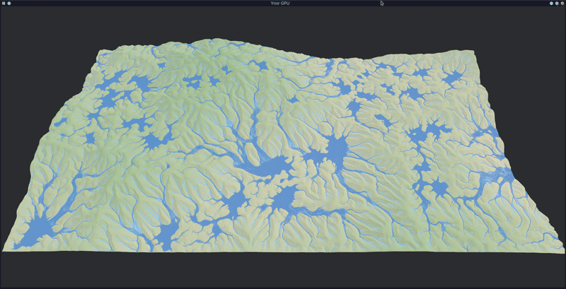

# Ymir-GPU

This is a implementation of *Fast Hydraulic Erosion Simulation and Visualization on
GPU* by Xing Mei, Philippe Decaudin and Bao-Gang Hu. 
https://inria.hal.science/inria-00402079/document

This implementation is written in Rust using Bevy and performs a hydraulic erosion simulation using multiple pass computer shaders.

I planned to expand this to include some basic initial map generation simulating tectonic plates and then adding a wind, rain and climate / biome simulation step following the hydraulic erosion step.

For now it just contains a thermal erosion step in addition to what is described in the paper. Work in progress.

The implemented paper has several issues which can be fixed by using this paper in stead: https://old.cescg.org/CESCG-2011/papers/TUBudapest-Jako-Balazs.pdf