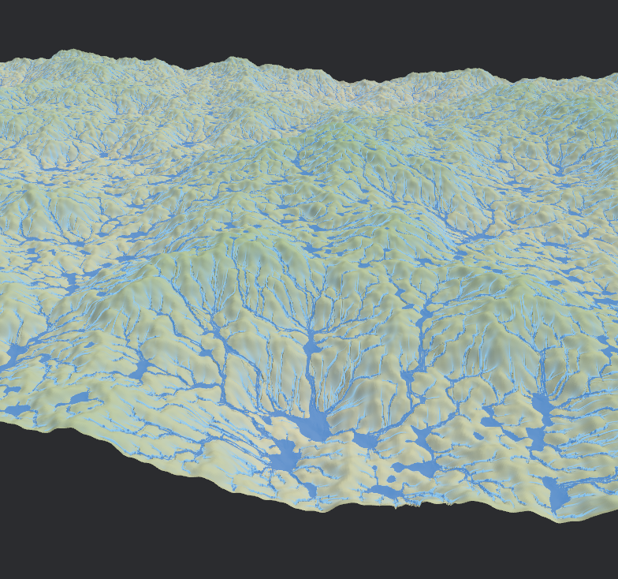

# Ymir-GPU

This is a implementation of *Fast Hydraulic Erosion Simulation and Visualization on
GPU* by Xing Mei, Philippe Decaudin and Bao-Gang Hu. 
https://inria.hal.science/inria-00402079/document

This implementation is written in Rust using Bevy and performs a hydraulic erosion simulation using multiple pass computer shaders.

I planned to expand this to include some basic initial map generation simulating tectonic plates and then adding a wind, rain and climate / biome simulation step following the hydraulic erosion step.

The actual erosion produced is not great, parameters need further tweaking. But this was mainly an experiment in learning how to use compute shaders for this kind of multi-step task.